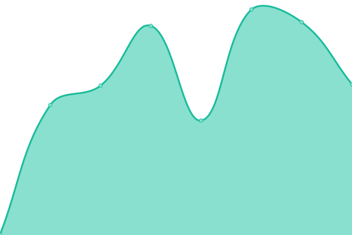
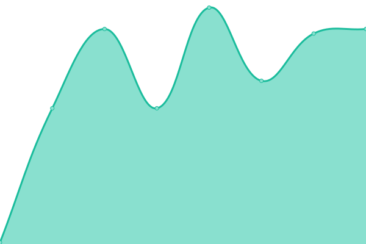
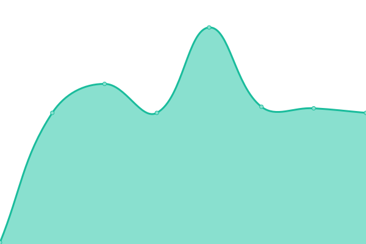

# [📈 Live Status](https://arynyklas.github.io/uptime): <!--live status--> **🟧 Partial outage**

This repository contains the open-source uptime monitor and status page for [Aryn](https://arynyklas.github.io/uptime), powered by [Upptime](https://github.com/upptime/upptime).

With [Upptime](https://upptime.js.org), you can get your own unlimited and free uptime monitor and status page, powered entirely by a GitHub repository. We use [Issues](https://github.com/arynyklas/uptime/issues) as incident reports, [Actions](https://github.com/arynyklas/uptime/actions) as uptime monitors, and [Pages](https://arynyklas.github.io/uptime) for the status page.

<!--start: status pages-->
<!-- This summary is generated by Upptime (https://github.com/upptime/upptime) -->
<!-- Do not edit this manually, your changes will be overwritten -->
<!-- prettier-ignore -->
| URL | Status | History | Response Time | Uptime |
| --- | ------ | ------- | ------------- | ------ |
|  [BinomTTBot](https://backend.isbotdown.com/bots/BinomTTBot) | 🟥 Down | [binom-tt-bot.yml](https://github.com/arynyklas/uptime/commits/HEAD/history/binom-tt-bot.yml) | 

 468ms
     
 | 

<a href="https://arynyklas.github.io/uptime/history/binom-tt-bot">0.00%</a>
    

|  [BinomTTSite](https://binomtt.sek.su/) | 🟥 Down | [binom-tt-site.yml](https://github.com/arynyklas/uptime/commits/HEAD/history/binom-tt-site.yml) | 

 0ms
     
 | 

<a href="https://arynyklas.github.io/uptime/history/binom-tt-site">100.00%</a>
    

|  [msg2textbot](https://backend.isbotdown.com/bots/msg2textbot) | 🟥 Down | [msg2textbot.yml](https://github.com/arynyklas/uptime/commits/HEAD/history/msg2textbot.yml) | 

 107ms
     
 | 

<a href="https://arynyklas.github.io/uptime/history/msg2textbot">98.77%</a>
    

|  [ArynTTBot](https://backend.isbotdown.com/bots/ArynTTBot) | 🟥 Down | [aryn-tt-bot.yml](https://github.com/arynyklas/uptime/commits/HEAD/history/aryn-tt-bot.yml) | 

 108ms
     
 | 

<a href="https://arynyklas.github.io/uptime/history/aryn-tt-bot">98.77%</a>
    

|  [SPOwnerBot](https://backend.isbotdown.com/bots/SPOwnerBot) | 🟩 Up | [sp-owner-bot.yml](https://github.com/arynyklas/uptime/commits/HEAD/history/sp-owner-bot.yml) | 

 107ms
     
 | 

<a href="https://arynyklas.github.io/uptime/history/sp-owner-bot">100.00%</a>
    

|  [HDRFilmsBot](https://backend.isbotdown.com/bots/HDRFilmsBot) | 🟥 Down | [hdr-films-bot.yml](https://github.com/arynyklas/uptime/commits/HEAD/history/hdr-films-bot.yml) | 

 104ms
     
 | 

<a href="https://arynyklas.github.io/uptime/history/hdr-films-bot">100.00%</a>
    

|  [SeeJSONBot](https://backend.isbotdown.com/bots/SeeJSONBot) | 🟥 Down | [see-json-bot.yml](https://github.com/arynyklas/uptime/commits/HEAD/history/see-json-bot.yml) | 

 104ms
     
 | 

<a href="https://arynyklas.github.io/uptime/history/see-json-bot">99.89%</a>
    

|  [ArynMusicalBot](https://backend.isbotdown.com/bots/ArynMusicalBot) | 🟥 Down | [aryn-musical-bot.yml](https://github.com/arynyklas/uptime/commits/HEAD/history/aryn-musical-bot.yml) | 

 106ms
     
 | 

<a href="https://arynyklas.github.io/uptime/history/aryn-musical-bot">0.00%</a>
    

|  [ArynIDBot](https://backend.isbotdown.com/bots/ArynIDBot) | 🟩 Up | [aryn-id-bot.yml](https://github.com/arynyklas/uptime/commits/HEAD/history/aryn-id-bot.yml) | 

 106ms
     
 | 

<a href="https://arynyklas.github.io/uptime/history/aryn-id-bot">100.00%</a>
    

<!--end: status pages-->

[**Visit our status website →**](https://arynyklas.github.io/uptime)

## 📄 License

- Powered by: [Upptime](https://github.com/upptime/upptime)
- Code: [MIT](./LICENSE) © [Aryn](https://arynyklas.github.io/uptime)
- Data in the `./history` directory: [Open Database License](https://opendatacommons.org/licenses/odbl/1-0/)
